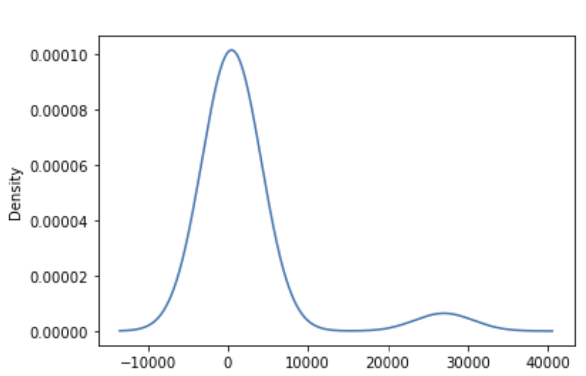

# Neural_Network_Charity_Analysis

## Overview

The objective of this module (**Module 19: Neural Networks and Deep Learning Models**) is to learn and apply machine learning (ML) to an _Alphabet Soup_ dataset using neural networks algorithms.

The input dataset contain information of more than 34,000 organizations that have received funding from Alphabet Soup over the years

Applying ML to this dataset will be used to create a binary classifier model that will help the foundation to predict where to make new investments.

## Resources

### List of Applications Used

The Scikit-learn and the Imbalanced-learn libraries are used to conduct machine learning in Python.

- _Python 3.9_
- _Scikit-learn 1.1_
- _Plotly 5.11.0_
- _TensorFlow 2.0_
  _Pandas 1.5.2_

### Input Datasets

- **[Charity Data](./Resources/charity_data.csv)**
- **[Starter Code](https://static.bc-edx.com/data/do-v1/m19/starter/Starter_Code.zip)**

## Deliverables

The following is the list of the requested and the provided deliverable files for this modules's challenge.

### Requested Deliverables

- **Deliverable 1.** Preprocessing Data for a Neural Network Model
- **Deliverable 2.** Compile, Train, and Evaluate the Model
- **Deliverable 3.** Optimize the Model
- **Deliverable 4.** A Written Report on the Neural Network Model

### Provided Deliverables

- **[Deliverable 1 and 2](./Deliverables_1_2/)**
- **[Deliverable 3](./Deliverable_3/)**
- **[Images of Results](./Images/)**
- **[Written Analysis](./README.md)**

## Methodolody

**Deliverable 1. Preprocessing Data for a Neural Network Model.**

The pre-processing of the data consisted in the following steps

1. Read-in the input data.
2. Drop unecessary columns
3. Use the density plot to create a cutoff point to bin "rare" categorical variables together in a new column
4. Generate a list of categorical variables.
5. Encode categorical variables using one-hot encoding, and place the variables in a new DataFrame
6. Merge the one-hot encoding DataFrame with the original DataFrame, and drop the originals
7. Split the preprocessed data into features and target arrays
8. plit the preprocessed data into training and testing datasets.
9. Standardize numerical variables using Scikit-Learn’s StandardScaler class, then scale the data.

Image 1 and 2 show an example of a column which values were bin into a single category. Binning the values simplify the amount of input data feed to the model. The application counts with a cutoff value of less than 528 were bin into a single "Other" category.

_Image 1: Deliverable1. Values Count of the Application Counts Column_.

_Image 2: Deliverable1. Density Plot of the Application Counts Column_.

**Deliverable 2. Compile, Train, and Evaluate the Model.**

1. Create a neural network model by assigning the number of input features and nodes for each layer using Tensorflow Keras.
2. Create the hidden layer(s) and choose an appropriate activation function.
3. Create an output layer with an appropriate activation function.
4. Check the structure of the model.
5. Compile and train the model.
6. Create a callback that saves the model's weights every 5 epochs.
7. Evaluate the model using the test data to determine the loss and accuracy.
8. Save and export your results to an HDF5 file

The model evaluation is shown in the Image 3. The results were saved in a _.h5_ format file. The file is reloaded and verified.

.

_Image 3: Deliverable2. Model Assessment_.

**Deliverable 3. Optimize the Model.**

Optimize your model in order to achieve a target predictive accuracy higher than 75%, make at least three attempts to do so.

| Attempt | Accuracy | Input Features | Hidden_layers | Nodes in Hidden Layer 1 | Nodes in Hidden Layer 2 | Activation Function for Hidden Layers | Activation Function for Output Layers | Total Parameters | Number of Iterations |    Loss Function    | Optimizer | Metrics  |
| :-----: | :------: | :------------: | :-----------: | :---------------------: | :---------------------: | :-----------------------------------: | :-----------------------------------: | :--------------: | :------------------: | :-----------------: | :-------: | :------: |
|    1    |  73.08%  |       42       |       2       |           60            |           30            |                 Relu                  |                Sigmoid                |       4381       |          50          | Binary_Crossentropy |   Adam    | Accuracy |
|    2    |  73.01%  |       42       |       2       |           60            |           30            |                 Relu                  |                 Tanh                  |       4381       |          50          | Binary_Crossentropy |   Adam    | Accuracy |
|    3    |  73.11%  |       42       |       2       |           60            |           30            |                 Relu                  |                 Tanh                  |       4381       |         100          | Binary_Crossentropy |   Adam    | Accuracy |

## Summary

Unfortunately any of the three attempts made achieve a model with an accuracy above 75%. In fact, the three attempts delivered a very close performance of around 73%.

Changing the output activation function from Sigmoid to Tanh had a slightly negative impact in the model performance. On the other hand, doubling the number of iterations helped to increase a bit the model accuracy.

Adding more than 2 hidden layers was not desired at this point to avoid overfitting the model.

A more detailed pre-processing of the data should be tested in the pursue of a higher accuracy model.
